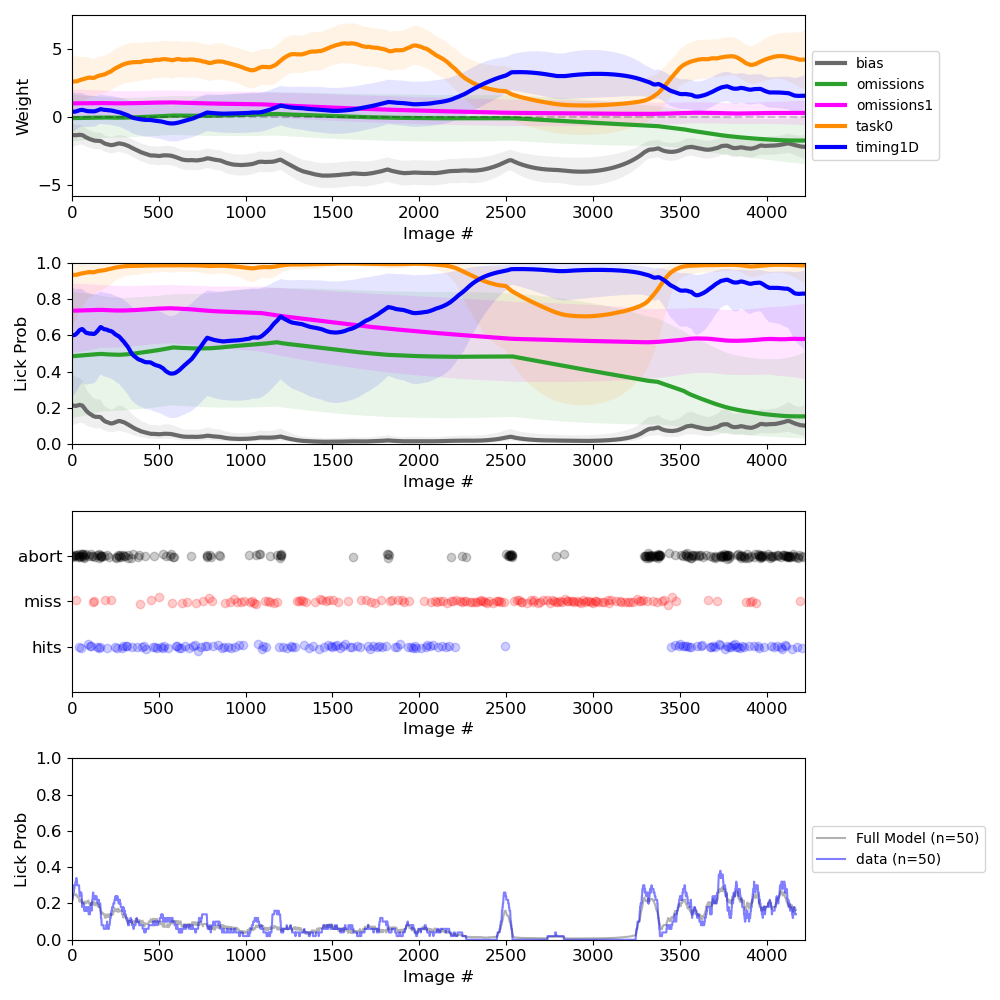
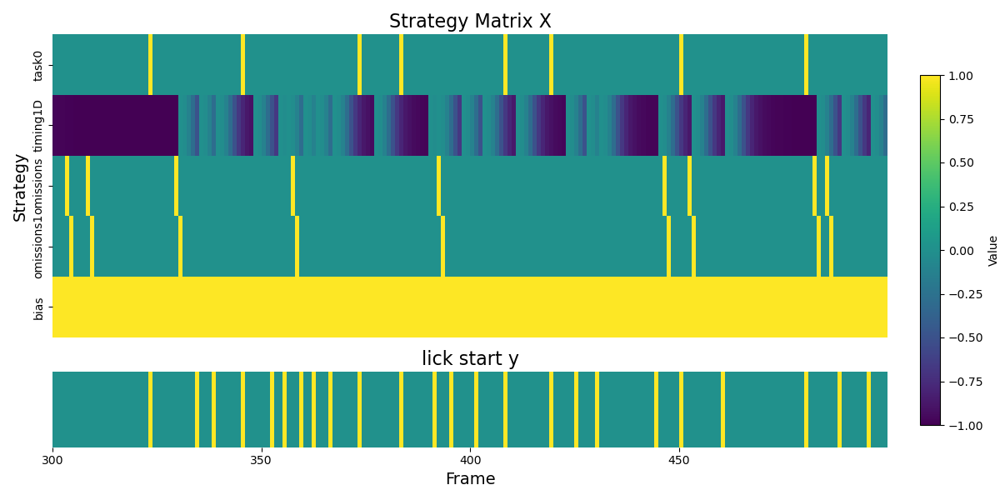
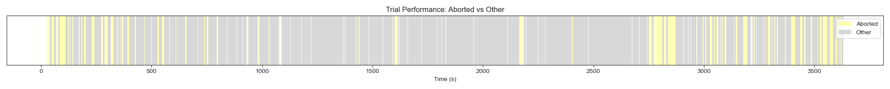
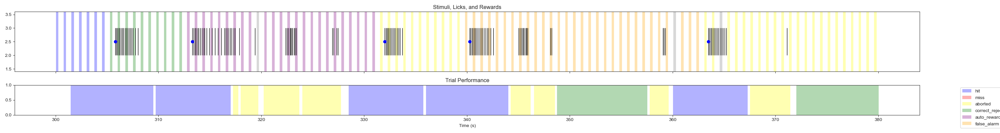

***
## INFO

We document in this repo the progress of modeling and inferring lick behavior in the Allen Visual Behavior Neuropixel Dataset. 

This will be the behavior focused branch in the group project. 


### Data
- here I load from a local hard drive; 
- but one can be alternatively obtained from the cloud server (Amzn S3 bucket);
- noticed that I don't seem to be able to modify some session attributes, like the `stimulus_presentations` df

***

### Useful resourses

#### The experiment:

- [change_detetion_task](https://allenswdb.github.io/physiology/stimuli/visual-behavior/VB-Behavior.html#change-detection-task)


####  Alex Piet's work:
<!-- -[Licking Behavior Ecephys](https://github.com/AllenInstitute/licking_behavior_NP) -->


- [Licking Behavior Ophys](https://github.com/alexpiet/licking_behavior/tree/master)

Note that both repos use some internal/local load paths that are a bit hard to parse what they really are... we also have different permission to access files.

####  `psytrack` package:
- [psytrack repo](https://github.com/nicholas-roy/psytrack/blob/master/psytrack/examples/ExampleNotebook.ipynb)
- We have installed it;
- the example ran very smoothly; see the `/psytrack_example` folder

***

### Logistics:

| Time | Event |
|------|-------|
| Saturday Aug 24 10:00 – 12:00 | Project proposal presentations |
| Saturday Sep 1 9:00 – 12:00 | Project presentations |

***
## Log of progress

### 08/25/24

1. Get familiarized with `stim_table` and `trials` dataFrames. 
2. Ran the most basic inference for a ecephys session in a very quick dirty manner;



- ignored: 
    1. one defination QC check (`licked`, but the variable was undefined somehow);
    2. the regression model for timing should be re fitted; 
    3. the detailed logic of defining the `bouts`, which is probably why 1 occured;
    4. I didn't pay attention at all how the exact choice of `y`'s set up, not something I expected. 

#### TO-DOs: 
1. fix the ignored problems;
2. model evidence, CV, etc;
3. keep brainstorming new strategies; "regret" (the first false alarm lick) was an idea through talking to my roomate 
4. ways to get behaviral data direction without getting ecepyhs session? 
5. any ways to change file write permission? 
6. go through in more detail `psytrack`'s usage
7. plot inter lick interval as well!!! 

### 08/26/24

Fixed the directly loading behaviral session issue;
Michael and Saskia said they don't recommending re-writing the attribute, and some files are fetched (?) fair.. I don't understand everything but it doesn't affect us too much.

Will use compare cross-validated log-likelihood to compare across models; but why there's such a big difference between cv and whole model fit?

I ran into push issue but this helped (maybe loading sessions? but how come?)

```
git config http.postBuffer 524288000
```

#### A quick quick summary for how the Inference is set up (Roy 2018a):

Actually it's pretty smart; maybe it's just my first time seeing this time diff trick. All weights, concatinated, can be expressed as a function of eta, and thus gaussian (eta = DW, where D is a banded matrix calculating time differece). Then the log posterior \propto log evidence + log prior can be written out, and that has a sparse Hessian, and thus inference can use 2nd order method with sparse operation.

After getting wMAP, updated hyperparams by Laplace approximation, and then update log-evidence.
  
(Back to logging)
- I read the psytrack Roy 2021 paper, method and notebook, read the Roy 2018a NeurIPS paper [first pass, read the function docs];
- Went through the bout definition, plot inter-bout-interval; now I decide to focus on the `wt/wt` mice, plot their licks during H session. (_Correction:_ realize that I plotted for every one before I kill the kernel! so can continue to do it... and bin it...)

Visualize design matrix, for some frames in the example session:
 


#### TO-DOs:
1. How to tease different senario's licks apart?
    - ICI for only after a bout-ish lick! is it 4-5 flashes you'll wait for? will we see a shift?
    - ICI for only after the first abortion lick! will that be substentially longer?
    - plot distribution plot but not 
2. Compare model evidence
3. Email Alex

### 08/27/24

__Information from Andrew__: for `false alarm` trials, trials actualy continues but not early stopped! Licks would lead to no reward, and next one will be another drawn! I was very wrong about it

__Information from Yoni__: the hard drive DOES NOT contain: behavior session not realted to Ecephys! so for scale up plot I would need to use a capsule; or download it from S3.

```
if stand alone behavior:
    - go fetch it; 
if included in ecephys:
    - load it from the ecephys session
```

I fetched all `wt/wt` from `allensdk` following [totorial 1](https://allensdk.readthedocs.io/en/latest/visual_behavior_optical_physiology.html#tutorials) here.

Start migrating the code (to `src_local`) the meantime when my data is loading ... est: in 3-6 hrs, so by tmrw morning, I will be setting up the system for bigger scale work.

For `psytrack`: Turn out that output `y` must be either [1 or 2](https://github.com/nicholas-roy/psytrack/blob/master/psytrack/getMAP.py) or if 0 or 1 will be fixed; don't know why but fine

#### Illustration for lick bouts:


#### Illustration for timing strategy


(Realized that on Sunday I plug in `a` and `b` in the opposite way; fixed it now.)


$$y(t)=y_{\min }+\frac{y_{\max }-y_{\min }}{1+(t / a)^b}$$


#### More thoughts about colinearity of strategies:

For the omitted and post-ommited: the ith of `omitted` and i+1 ith of `post-omitted` will do the eact same to y with one time offset.

### 08/28/24

Met with group, today I'll aim to produce the indices for all sessions once session downloads well; if capable of this overnight (it's quicker using just the total model fit, which Alex used for his).

- All behavior only mouse downloaded! 
- I just defined the pure timing strategy based on the ideal geometric distribution, so can use that as well and compare with the `timing1D` distribution.
- Both method working now, added some visualization;


#### TO-DO:
0. how to load different sessions;
1. write ROC code;
2. model comparison sturcture (lesion);
3. different timing strategy comparison;


#### Notes from meeting with Alex:
1. yes difference in different categorial coding doesn't matter too much;

2. see Supp. Figure 3 for the timing strategy build up;

3. 1) Are mice more likely to revert to the timing strategy after a rewarded lick?
    - He suspects this is true. It certainly looks like this happens, but I never quantified it. I think the dynamic weights of the model should capture this effect. One way to quantify it would be to look at the reward-triggered change in the timing strategy weights. We might need to compare that to a shuffle, or unrewarded lick bout. 
3. 2) Are mice less likely to use timing-based licks after an aborted trial, once they understand the punishment?
    - Its possible, but the punishment for the aborted trial is small, mostly a restarting of the trial. We could try to quantify it. 

4. Use AUROC for goodness of fit; and use evidence to compare bethween.

Others: Supplementary Figure 7 has quiet a lot of interesting things to look at.


### 08/29/24
Will need to figure out the singular matrix issue but no we simply ignored a session in `TRAINNING_4`;

#### The attempt to get within session strategy info for each frame:     

- within a session: 
    - for the changed:
        - define a score: w_timing-w_visual;
        - bin the changed frames by that -- see if there are different 

#### TO-DOs:
- I will subset licks with reward, and look right after weight chnage -- like in Spike-triggered Average (STA); 
- AUC [done]; 
- lick statistics to motivate timing - your own way to set it up?
    - get all licks after filtering 700s.

### 08/30/24

- Geom model and 1D model by Alex correlates very well in their strategy index preferences (R = .87). 
- Realize that I might need to rerun the training5 data... as I didn't save test metric till the very end :/ and the saved contains some repeats? But maybe still usable..? But I am now trying to detect truncated files and replace them with good ones.
- **talking to TA Virgil**: 
    - rythmic running speed changes for different strategy mice
    - generalist and specialist mouse: variability -- for generalist their performance might be predicted by pupil diameter/their arosal state?

- Alex's own fitting for the NP data: [Figures and others](https://drive.google.com/drive/folders/1UXPUp9YiNcxm55TIEZjMntz5W6VMwzJ_?usp=drive_link)


### 09/03/24

#### Summary of the findings:

**Training History**

1. The more visual mice have undergone more sessions of training than the timing mice.
2. A behavioral predictor for timing strategy is that they slow down more, and they started slowing down way before the licking event (some credits go to Vergil!)

**Neural Correlates**
3. There is differential feedforward and feedback interactions between VisP and 4 higher visual areas when the mice is using different strategies during licks (esp. area am).

    - The CCA method paper used: [Semedo et al 2022](https://www.nature.com/articles/s41467-022-28552-w)

    - Potential related mechanism: [Sit & Goard, 2020](https://www.nature.com/articles/s41467-020-17283-5)

A tiny bit of post workshop wrap up. 

Finish inference to get strategy index for other stages with the images as the singal (`TRAINING 3`, `TRAINING 4`, `TRAINING 5`)

- get their max d-prime, but I don't know how comparable they will be with Ecephys's inference, as the model's different (without omission) and the reward's a bit different;
- Training 4 [done]
- Training 5 []
- Training 3 []

The perplexing thing for me still, is that, if their strategy index stays consistent, it means that before it was ready, it must have more training - but that would mean that their d-prime was low, or not consistent, even they are using the optimial strategy. But how could that be possible? Are those mice have longer period of disengagement?

- how to figure this out?
    1. plot the index by animal, to see if the same trend still holds, and color them by session;
    2. plot the number of sessions each of the 27 animals.

***

### General qestions: 
1. why we see `> 5` consecutive aborted trails? 

_Answer (from Marina):_  that is very likely; as the 5 trials specify the fixed number of frames, but after 5, same image will still be flashed 
 

2. is start of trail right after the change, or right after 3 sec grace period if hit trial?


_Answer (from Marina):_ no matter hit or miss, the mice will get a 4-flashes grace period; then the draw specify the # of frames from:


3. clarification from Marina about the logic behind the timing strategy:

It more like serving the minimum wait time the mouse is oaky to bear, against it's lick urge, as 4 frames is the most frequent and also the least amount of time its willing to bear.

4. are the `G` and `H` sessions consecutive on the same day?
_Answer (from Marina):_ yes..? Another thing is that even within the session, there is active behavior period, reward and passive replay period.

